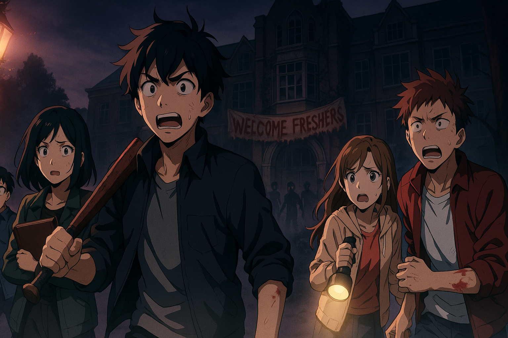

---

# DEAD SEMESTER

`Early Draft, May Change`

*`A College Zombie Survival Animated Webseries`*

---

## Overview

**Dead Semester** is a slow-burn horror-thriller set in an Indian college where a routine blood drive becomes the ignition point for a viral outbreak — not designed to end the world, but to **engineer it**. But control is an illusion. The company behind it, SynGenix, watched its perfect system fracture from the inside. Now, trapped behind quarantine walls, a group of students must confront the infected, the lies they were raised on, and a chilling truth that was never meant to surface.

---

> *"We built the model. It obeyed — until it didn't." — Internal SynGenix Collapse Memo*

> *"The semester was never meant to end. Just… evolve."*

> *"The dead don't walk. Not until we tell them to." – SynGenix Internal Memo, 2 weeks before Outbreak A-17*

---

### Structure

* **3 Seasons**
* **10–15 min episodes**
* Each season unravels new layers: **Campus → Collapse → Conspiracy**

| Season | Title                 | Theme                                                  |
| ------ | --------------------- | ------------------------------------------------------ |
| 1      | **Campus Outbreak**   | Claustrophobic horror, slow unravel                    |
| 2      | **Campus Collapse**   | Faction warfare, survival ethics, system breakdown     |
| 3      | **Truth & Rebellion** | High-stakes sci-fi, digital warfare, identity collapse |

---

## MAIN CAST

* **Aarav Sen** – The reluctant tactician, haunted by survival guilt  
* **Zoya Feroze** – The chaotic genius, too smart to not notice the system glitching  
* **Riya D’Souza** – The intuitive artist, whose sketchbook holds more than memory  
* **Trisha Kapoor** – The emotionally distant medic, trained by SynGenix long before she knew  
* **Naveen Raj** – The dependable athlete, hiding a family link to the corporation that doomed them  

> All arcs intertwine. Every death echoes. Every survivor breaks… differently.

---

## SEASON 1 – *Dead Semester: **Patient Zero***

> *The infection begins. The walls start cracking.*

### Ep1 – "Routine Check"

* A blood donation camp by SynGenix rolls into campus, oddly well-funded.
* Ordinary day: jokes, classes, chaos.
* One donor collapses. Doesn’t get back up.

### Ep2 – "Control Subject"

* Donors report headaches. Lights flicker. Guards vanish.
* Surveillance shows crates being escorted by private forces at night.
* Trisha spots a barcode she’s seen before in a childhood clinic.

### Ep3 – "Patient Zero"

* A student mutates in front of a crowd. Panic detonates.
* He bites two others before being restrained. One disappears.
* Within an hour, five more show symptoms. Containment fails.
* Core group seals off the mess hall — the only space with reinforced doors and functional CCTVs.

### Ep4 – "Curfew"

* Students fragment into cliques. Some enforce their own rules.
* The infected breach blocks at night.
* First betrayal: a friend is left outside a barricade.

### Ep5 – "In Memoriam"

* They mourn. Too early.
* Zoya builds a sonic disruptor. The infected react to frequency shifts.
* Riya's sketches, drawn in dreams, mirror security footage she’s never seen.

### Ep6 – "Midnight Broadcast"

* SynGenix addresses the campus via hijacked PA: "Remain calm. You are safe."
* Trisha decrypts internal logs: the campus is Test Group A-17.
* Someone poisons the food supply. It wasn't the infected.

### Ep7 – "Evacuate"

* SynGenix helicopters arrive, but only for "priority-tagged" students.
* Aarav makes the call. Zoya stays back.
* On the wall: **"Don't let them win."** written in dried blood.

---

## SEASON 2 – *Dead Semester: **Campus Collapse***

> *Survival reveals who we really are.*

### Ep1 – "Wards of Ruin"

* Campus is a warzone. Dorms are factions. Lecture halls are kill zones.
* Aarav leads a tactical raid for medicine.
* The biotech wing is now a SynGenix stronghold.

### Ep2 – "Echo Protocol"

* Zoya fine-tunes her sonic disruptor; it affects infected *and* scanners.
* Riya uncovers sketches of Project A-17 in an abandoned art classroom.
* Trisha finds a drone tagged with her childhood hospital ID.

### Ep3 – "The Infirmary Pact"

* The medical block promises safety, but it's a cult of immune students.
* Naveen suspects their leader is faking immunity.
* Flashbacks reveal SynGenix once tested on student athletes.

### Ep4 – "Redacted"

* Surveillance hard drives from the Admin Office are recovered.
* Footage shows Zoya's father leading early SynGenix experiments.
* A symbol keeps recurring: A-17 embedded inside an ouroboros.

### Ep5 – "Trigger Discipline"

* A hostage situation erupts over water supply.
* Naveen is forced to kill — it changes him.
* Infected break into the server room, fry the last uncorrupted records.

### Ep6 – "The Break Line"

* A campus-wide blackout occurs.
* Factions dissolve. A fire starts in the engineering wing.
* Riya sketches something that hasn't happened yet.

### Ep7 – "The Plan"

* The core group reforms. Objective: reach the biotech tower.
* SynGenix is rebooting their AI grid from inside the tower.
* They split up, knowing some won’t survive the next 24 hours.

---

## SEASON 3 – *Dead Semester: **Cure Code***

> *It was never just a virus. It was a simulation with stakes.*

### Ep1 – "New Semester"

* SynGenix's AIs now control isolated "safe cities" beyond campus.
* Riya leads a rebel cell using her dreams as tactical guidance.
* A new virus strain: silent, coded to mimic emotions.

### Ep2 – "Project Lazarus"

* Trisha finds lab files proving the virus was created to erase extreme emotional states.
* The original patient zero was a neural net given synthetic memory.
* Footage shows Riya as a child drawing the same symbols still appearing now.

### Ep3 – "Inside Out"

* Aarav breaches the biotech tower’s sublevels.
* Inside, he finds a clone of himself in cryostasis.
* Turns out: the core group were mirrors of pre-constructed psychological archetypes.

### Ep4 – "The Tower"

* The rebel group infiltrates the server hub.
* Zoya injects her own neurodata into the system — rewriting the digital immune protocol.
* A-17 was not a test. It was the launch.

### Ep5 – "Fade"

* Infected speak in fragments. Zoya recognizes her mother’s voice in one.
* Riya’s sketchbook catches fire, revealing hidden text beneath the pages.
* Survivors realize: they were never meant to survive. They were meant to reboot.

### Ep6 – "Rebellion"

* Zoya uploads her final virus, embedded with memories and glitches.
* SynGenix systems collapse. City lights die. AIs short out.
* The infected freeze. Some begin to cry.

### Ep7 – "Dead Semester"

* Silence. Campus overrun by flowers growing through concrete.
* The group walks through the ruins. Free, but permanently changed.
* Final scene: Zoya’s voice recording plays.

---

> *“College ends. But they didn’t tell us what came next.”*

---