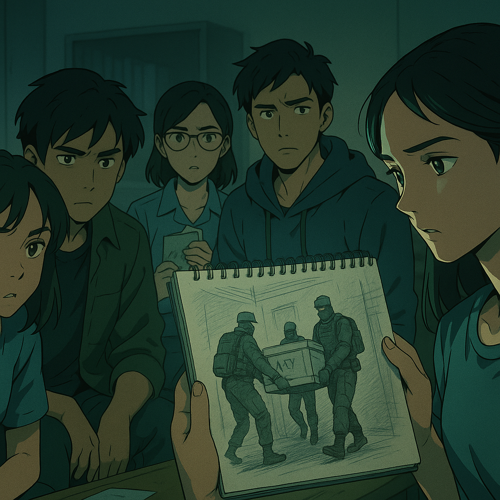

---

## **S1E2 — “Control Subject”**

*Duration: \~12 min*

> *“They told us it was routine. But routine doesn’t come with body bags.”*
> — *Trisha Kapoor, Incident Log Draft (unsent)*

---

## STRUCTURE:

| TIME  | SECTION          | CONTENT                                                             |
| ----- | ---------------- | ------------------------------------------------------------------- |
| 00:00 | **Cold Open**    | Student faints in class. Blood from the nose. Power flickers.       |
| 01:00 | **Act 1**        | Rising tension. Multiple donors feel ill. Campus rumor mill starts. |
| 03:30 | **Act 2**        | Zoya sees crates escorted by black-ops style SynGenix personnel.    |
| 06:00 | **Act 3**        | Trisha discovers matching barcode. Childhood memory flashes.        |
| 08:30 | **Act 4**        | Kitchen cold storage failure. Body bag inside. Denied access.       |
| 10:30 | **Closing Beat** | Riya finishes a sketch — identical to what Zoya saw hours ago.      |

---

## FULL EPISODE SCRIPT

---

### \[COLD OPEN – 00:00]

*INT. BIOLOGY PRACTICAL LAB – DAY*

Class is mid-dissection. The room is cool, fluorescent-lit, silent except for murmurs.

A student at the back **groans** suddenly and **collapses**, hitting the ground.

Blood trickles from his nose. The teacher shouts. Others back off.

Lights flicker.

**Camera POV** shifts to a nearby SynGenix security officer — frozen, watching. Then slowly turning and walking away.

---

### \[ACT 1 – 01:00]

*EXT. CAMPUS CANTEEN – MIDDAY*

, they looked… drained.”

**Aarav** watches the SynGenix tent in the distance.
**Zoya**, already suspicious, mutters:

> “High-end security for a free juice box? Cute.”

---

*INT. MED WING – LATER*

**Trisha** reviews basic med slips while helping sort leftover files.

She finds one with a **barcode** — clean, sterile, but oddly familiar.

> *INSERT FLASHBACK — CHILDHOOD CLINIC, AGE 10*
> Trisha sits in a white room, alone. A similar slip is handed to a nurse.

Cut back to present.

> **Trisha (to herself):**
> “No way...”

---

### \[ACT 2 – 03:30]

*EXT. HOSTEL BLOCK – NIGHT*

**Zoya** climbs onto the terrace with a pair of binoculars (borrowed from Naveen).

Below, **crates** are being moved into the old staff quarters building.

They’re escorted by **SynGenix guards** — but not medics. These guys wear full **black tactical armor**, face masks, earpieces.

One guard spots movement.

Zoya ducks low. Heart pounding.
The moment passes.

---

*INT. GUARD ROOM – LATER*

Monitors show the crate movement.
One screen cuts to static. Another plays on loop.

> *SFX: digital buzz, glitch click*

---

### \[ACT 3 – 06:00]

*INT. MESS HALL – EVENING*

**Trisha**, distracted, joins the group dinner late. She's clutching the barcode slip in her pocket.

**Riya** is quiet — sketching. Her paper shows shadowy figures… dragging crates.

> **Trisha:**
> “Did you… see something?”

> **Riya:**
> “No. I just felt it.”

Beat of silence.

Suddenly, the **lights in the mess kitchen pop off.**

A weird noise from the cold storage — like a **vacuum seal failing**.

They peek inside.

A **SynGenix body bag** lies on the floor. Frosted over. **No explanation.**

A janitor tries to close the door.

> **Zoya:**
> “You gonna tell us what that is?”

> **Janitor (blank):**
> “You didn’t see anything.”

---

### \[ACT 4 – 08:30]

**Later that night.**

The group reassembles at Zoya’s room.

She shows the footage she grabbed on her phone — blurry video of the crate transport.

> **Aarav:**
> “Could be lab gear. Could be people.”

> **Naveen:**
> “Could be overreaction. We’re stressed.”

> **Zoya:**
> “No. We’re being quarantined… and no one said it out loud.”

---

*INT. RIYA’S DORM – FINAL SCENE*

**Riya** stares at her sketchbook. Finishes shading.

She flips the page to show a perfect sketch —
A crate being carried by masked men.

Exactly what Zoya saw hours ago.

**She never left the dorm.**

---

### \[ENDING – 11:30]

Camera pans out to show her room.
One page from her book floats to the floor. On the back, a rough date:

> **“Drawn: Day before yesterday.”**

**Cut to black.**

---

### \[POST-CREDIT STINGER – 12:30]

*INT. SERVER ROOM – UNKNOWN LOCATION*

Footage from Zoya’s spy cam uploads via unknown route.
A new folder appears:

> **"Subject Watch: Group A17 - Breach Signal Detected"**

Camera freezes.
File opens.
**Trisha’s barcode appears on screen.**

---