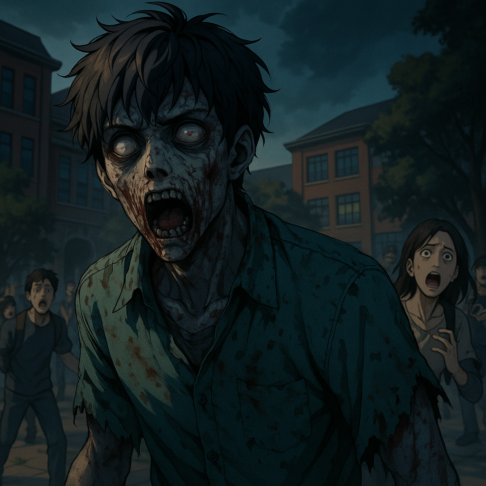

---

## **S1E3 – “Patient Zero”**

*Duration: \~13 min*

> *“Monsters don’t knock. They remember how to use the door.”*
> — *Aarav Sen, Campus Memoirs – Restricted Section*

---

## **STRUCTURE**

| TIME  | SECTION   | CONTENT                                                              |
| ----- | --------- | -------------------------------------------------------------------- |
| 00:00 | Cold Open | Surveillance log: blurry footage of a student restrained, screaming. |
| 01:00 | Act 1     | Students fall sick. One vomits blood. No medics.                     |
| 04:30 | Act 2     | First transformation — cracking bones, eye hemorrhaging.             |
| 07:00 | Act 3     | Infection spreads — four attacks in 10 minutes.                      |
| 10:00 | Act 4     | Survivors fortify mess hall. Someone didn’t make it.                 |
| 11:30 | End Beat  | Zoya sees a figure **watching** the mess hall, not attacking.        |

---

## **FULL EPISODE SCRIPT**

---

### \[COLD OPEN – 00:00]

*INT. SURVEILLANCE ROOM – STATIC FOOTAGE*

Grainy, timestamped footage.
A restrained **student** thrashes on a cot. Screams muffled under a gag.
**Crimson veins** spider across his face.

Two SynGenix personnel argue offscreen. One turns to the camera, lips mouthing:

> **"It’s too early. Shut it down."**

Frame glitches.
The student jerks upright — eyes bleeding black tears.
**Lights cut out. Screams.**

**SMASH TO TITLE: DEAD SEMESTER**

---

### \[ACT 1 – 01:00]

*INT. CAMPUS – MORNING*

It’s not sunny. It’s overcast.
The energy is wrong.
Post-blood-drive flyers now hang limp. Some are… **wet** with something.

Inside the classroom, three students are absent.
One suddenly **vomits blood** onto his textbook.

> **Professor Menon:**
> “—My god. Somebody call—”

No one comes.

---

*INT. GIRLS' HOSTEL – BATHROOM*

Riya stares in the mirror.
Under her fingernails: dark dust. She doesn’t remember drawing last night.

She flips her sketchbook: **a charcoal sketch of a hallway, crates, masked men**.

> **Riya (softly):**
> “This wasn’t here yesterday…”

---

### \[ACT 2 – 04:30]

*EXT. LIBRARY STAIRS – NOON*

Crowds scream.

A student convulses in the open.
He **stands mid-spasm**, mouth frothing, shoulders twitching unnaturally.

Then—
**Snap. Crack. Pop.**
His spine **arches backward**, ribcage visibly shifting under the skin.

He **howls**, a raw, gurgling sound.
His **eyes hemorrhage**, leaving black trails.

Then he **runs.**

**Fast. Toward the nearest body.**

Blood. Screams. Panic spreads faster than logic.

---

### \[ACT 3 – 07:00]

*INT. BIOCHEM LAB – MOMENTS LATER*

Zoya throws a chair into the door mechanism.
Trisha grabs scalpels. Aarav scans the emergency blueprint.

> **Zoya:**
> “We need to get to high-ground, thick walls.”

> **Trisha (hyper-focused):**
> “They’re not dead. Their bodies are overheating—fast neural misfires. It’s… programmed.”

> **Riya (whispers):**
> “It’s not just sickness. They *see* us.”

---

*EXT. CAMPUS COURTYARD – CHAOS*

Two more infected appear, dragging limp legs — but moving **unnaturally fast** in bursts.
One student’s **throat is torn open** before he can scream.
Blood paints the notice board. People **stop filming.** They **start running.**

---

### \[ACT 4 – 10:00]

*INT. MESS HALL – NIGHT*

The group — Aarav, Zoya, Trisha, Riya, Naveen — slam metal beams across the entrance.
Lights flicker. Emergency LEDs cast red shadows.

One student is **missing**.

> **Naveen:**
> “She was right behind me—she—”

No one responds.

The hall is silent except for Riya’s sketching.
She’s drawing the infected — but **with their old faces**, eyes filled with memory.

---

### \[ENDING – 11:30]

*INT. MESS HALL – LATER*

The radio crackles static.
A faint message cuts through:

> **“Test group A-17: Initiating escalation.”**

They turn off the lights. Hide.

Outside — not banging — but a **tap**.
Slow. Deliberate.

A silhouette stands beyond the broken cafeteria glass, just outside the beam of moonlight.

**Watching.**

Then walks away.

---

### \[POST-CREDIT – 12:30]

*INT. SYNGENIX CENTRAL – NIGHT*

On a digital monitor:
**Subject Zero: ACTIVE. Infection Path: Accelerated.**

> **Voice (offscreen):**
> “Let’s see how long they last… without instructions.”

**CUT TO BLACK.**

---